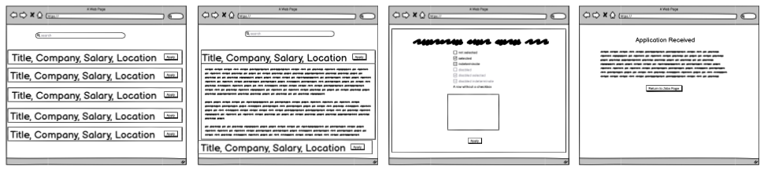
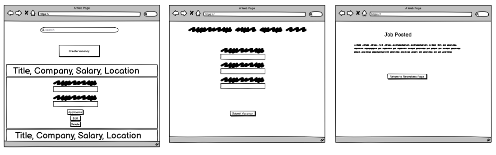
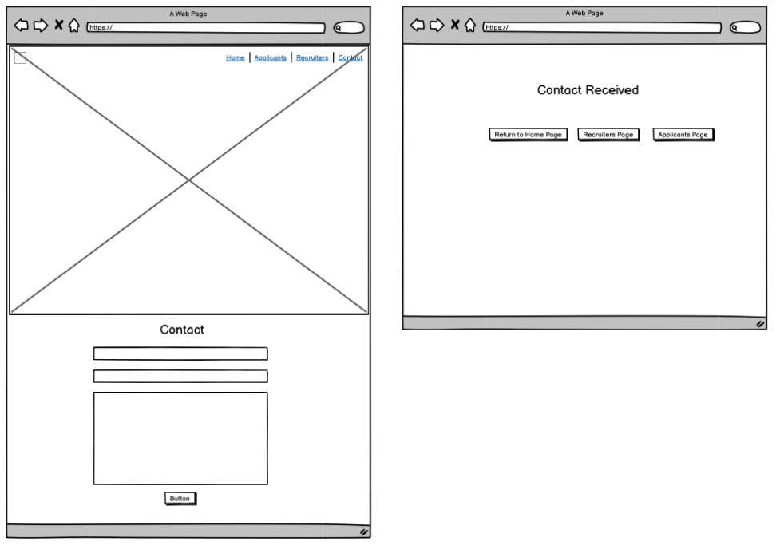

# Purpose

In this project, a full-stack site has been created. The site allows users interact with a database (the developer opted for using a relational database management ststem), in the form of a recruitment website.

The websites central tenet is for job seekers to view job listings and apply for a role. For recruiters, they're able to add listings to the website - in additiona to creating a listing, they're able to edit the listing, delete the listing, or view applicants for each listing.

The home page contains basic information about the sites purpose, provides a map of where the company is based, and provides a carousel of the types of roles that are held within the website.

Users are also able to get in touch with the administrators of the website via a contact page.

The target audience for recruiters who want to list vacancies they're trying to recruit for, as well as job seekers, who're looking for employment.

This website was made for the third of four milestone projects required to complete the diploma in software development program at The Code Institute.

[Click Here to View the Website!](https://alexzanotti.github.io/milestone_project_3/)

# Value provided:

Value provided:
* Users make use of the site to share their own data with the community, and benefit from having convenient access to the data provided by all other members.
* The site owner advances their own goals by providing this functionality, potentially by being a regular user themselves. The site owner might also benefit from the collection of the dataset as a whole.
* Value has been provided to satisfy the various user profiles/stories, as the website was structured around the user stories.

# Project Requirements

## Main Technologies
* HTML
* CSS
* JavaScript
* Python+Flask
* PostgreSQL
* Additional libraries and external APIs

## Mandatory Requirements
In order to pass this milestone project, the following requirements must be met:

1. Data handling: Build a Relational OR Non-Relational Database backed Flask project for a web application that allows users to
2. store and manipulate data records about a particular domain.
3. Database structure: Put some effort into designing a database structure well-suited for your domain. Make sure to put some thought into the relationships between records of different entities.
4. User functionality: Create functionality for users to create, locate, display, edit and delete records (CRUD functionality).
5. Use of technologies: Use HTML and custom CSS for the website's front-end.
6. Structure: Incorporate a main navigation menu and structured layout (you might want to use Materialize or Bootstrap to accomplish this).
7. Documentation: Write a README.md file for your project that explains what the project does and the value that it provides to its users.
8. Version control: Use Git & GitHub for version control.
9. Attribution: Maintain clear separation between code written by you and code from external sources (e.g. libraries or tutorials). Attribute any code from external sources to its source via comments above the code and (for larger dependencies) in the README.
10. Deployment: Deploy the final version of your code to a hosting platform such as Heroku.
11. Make sure to not include any passwords or secret keys in the project repository.

# UX

## The ideal users for this website:
* Job Applicants
* Job Recruiters

## User Stories

### Job Applicants User Stories

* As a Job Applicant, I want to learn more about the recruitment company, so that I can make an informed decision to proceed with my application.
* As a Job Applicant, I want to view job listings held within the site, so that I can see what roles I can apply for.
* As a Job Applicant, I want to apply for a job so that I can gain employment.
* As a Job Applicant, I want to be able to contact the site administrators, so that they can answer any queries.

### Job Recruiters User Stories

* As a Recruiter, I want to list a job vacancy, so that I can fill a position within my company
* As a Recruiter, I want to be able to edit a vacancy that I've created, so that if I've made a mistake, or the vacancy details have change, I'll be able to make the amendment.
* As a Recruiter, I want to be able to delete a vacancy, so that in the instances that I'm no longer recruiting for a position, I can remove the vacancy.
* As a Recruiter, I want to view applicants for the vacancy, so that I can contact applicants that I'm interested in interviewing.
* As a Recruiter, I want to edit applications for the vacancy, so that I can correct data once I've made contact with the applicant.
* As a Recruiter, I want to delete applications for the vacancy, so that I can remove unsuccessful applicants.

## User Story Images 

### User Story 1
* As a Job Applicant, I want to learn more about the recruitment company, so that I can make an informed decision to proceed with my application.

### User Story 2
* As a Job Applicant, I want to view job listings held within the site, so that I can see what roles I can apply for.

### User Story 3
* As a Job Applicant, I want to apply for a job so that I can gain employment.

### User Story 4
* As a Job Applicant, I want to be able to contact the site administrators, so that they can answer any queries.

### User Story 5
* As a Recruiter, I want to list a job vacancy, so that I can fill a position within my company

### User Story 6
* As a Recruiter, I want to be able to edit a vacancy that I've created, so that if I've made a mistake, or the vacancy details have change, I'll be able to make the amendment.

### User Story 7
* As a Recruiter, I want to be able to delete a vacancy, so that in the instances that I'm no longer recruiting for a position, I can remove the vacancy.

### User Story 8
* As a Recruiter, I want to view applicants for the vacancy, so that I can contact applicants that I'm interested in interviewing.

### User Story 9
* As a Recruiter, I want to edit applications for the vacancy, so that I can correct data once I've made contact with the applicant.

### User Story 10
* As a Recruiter, I want to delete applications for the vacancy, so that I can remove unsuccessful applicants.

## Development Planes

### Strategy Plane
The strategy from this project incorporates the requirements derived from the user stories. This website will focus on the following target audience, divided into two main categories:

* Job Applicants
* Job Recruiters

#### Personality
* Intelligent
* Technical Minded
* Early Adopters

#### Demographic
* Age - 22-40
* Gender - Male/Female
* Education - College

### Scope Plane
In scope for this project are the following requirements:

* Information about the recruitment company
* Job listings held within the site are visible
* Applications for a listing is possible
* Users are able to contact the site administrators
* Job listings can be created
* Job listings can be edited
* Job listings can be deleted
* Job applicants can be viewed
* Job applicants can be edited
* Job applicants can be deleted

### Structure Plane
The main structure of the website will be as follows:
* Home Page - this contains information about the recruitment company
* Applicant Page - this is essentially a jobs board, containing all listings
* Recruiter Page - this is where listings are held, for recruiters to view applicants/edit/delete
* Contact Page

#### Listings
In order to create a listing, there is the following page:
* Recruiter List

When the listing has been created, the recruiter is taken to the following page:
* Recruiter Listed

In order to edit a listing, the user is taken to the following page:
* Recruiter Edit

In order to view applicants to a listing, the user is taken to the following page:
* Recruiter Applicants

In order to edit applicants to a listing, the user is taken to the following page:
* Recruiter Applicants Edit

#### Applicants
In order to apply to a listing, there is the following page:
* Applicants Apply

When the applicant has applied to the listing, the applicant is taken to the following page:
* Applicant Applied

#### Contact
Once the user has submitted the contact form, they're taken to the following page:
* Contact Sent

### Skeleton Plane
For the skeleton plane, wireframes were made using [Balsamiq](https://balsamiq.com/). 

### Balsamiq Wireframe Images
Below are the Wireframes created in Balsamiq for this project:
* Home Page Wireframe

* Applicant Pages Wireframe

* Recruiter Pages Wireframe

* Contact Pages Wireframe

### Surface Plane

The Surface Plane of the website is designed to provide a visually engaging and user-friendly experience. The website features a sleek and modern design with a color scheme that emphasizes professionalism and innovation. The website's layout is organized in a way that makes it easy for visitors to navigate and find the information they need

# Technologies Used

## Main Technologies Used
### HTML5
### CSS3
### Javascript
### Python 3 + Flask
### PostgreSQL

## Frameworks, Libraries & Programs Used
### Balsamiq
### Bootstrap
### codebeautify.org/python-formatter-beautifier
### EmailJS
### Font Awesome
### GitHub
### GitPod
### Google Fonts
### Google Maps API
### jigsaw.w3.org/css-validator
### JSHint
### validator.w3.org

# Features

## Base

### Header
- Bootstrap is used to construct the header 
- When hovering over a different list item, the color will change

#### Header Responsiveness
- For smaller screens, a hamburger navbar icon is used, in which the list items appear in the dropdown

### Header Image
- An image is used for each page just below the navbar
- The title for each page is coloured red, held at the center of the image

### Footer
- Bootstrap is used to contruct the footer
- The "About" information is held on the left hand side of the page (for larger screens)
- The "Links" information is held within the center of the footer (for larger screens)
- The "Head Office Contact" information is held on the right hand side of the page (for larger screens)
- Fontawesome Icons are used to denote the Head Office Contact information
- the bottom of the footer contains the Recruitment World copyright

#### Footer Responsiveness
- For smaller screens, the "About", "Links" and "Head Office Contact" sections are displayed in block.

## Home Page
- The home page contains introductory text, describing the website
- A Google Maps API is used to display where the offices are located
- A Sectors section is used to display the sectors that the recruitment company is suited for
- The Our Pages section is used to inform the user of the applicants and recruiter pages
## Home Page Responsiveness

## Applicant Page
- the applicants page holds anchor elements for each job listing
- the anchor elements contain the following data: Job Title, Salary, Location, Company Name
- when clicking on a anchor element, a collapsible section appears, containing full data about the job listing
- within each collapsible, an apply button is presented, allowing the applicant to apply to the listing
## Applicant Page Responsiveness

## Recruiter Page 
- a listing button is presented, which takes the recruiter to the recruiter list page
- the anchor elements contain the following data: Job Title, Salary, Location, Company Name
- when clicking on a anchor element, a collapsible section appears, containing full data about the job listing
- within each collapsible, a view applicant button is presented, taking the recruiter to the recruiter applicants page
- within each collapsible, an edit listing button is presented, taking the recruiter to the recruiter edit page
- within each collapsible, a delete listing button is presented, allowing the applicant to delete to the listing
- a modal is presented when clicking the delete button, to allow the recruiter an opportunity to confirm that they want to delete the listing
## Recruiter Page Responsiveness

## Contact Page
- The contact page contains a form that the user is able to complete. It asked for their Name, Email, Query Type and Message.
- At the bottom of the contact form, there is a send button, which sends the email to the administrators and redirects the user to the contact sent page

## Contact Sent Page
- A confirmation message is displayed to the user
- a return to homepage button is presented, redirecting the user to the home page
- a applicants page button is presented, redirecting the user to the applicants page
- a recruitment page button is presented, redirecting the user to the recruiter page
## Contact Sent Responsiveness

## Applicant Applied Page
## Applicant Applied Responsiveness 
## Applicant Apply Page
## Applicant Apply Responsiveness
## Recruiter Applicant Page
## Recruiter Applicant Responsiveness
## Recruiter Applicant Edit Page
## Recruiter Applicant Edit Responsiveness
## Recruiter Edit Page
## Recruiter Edit Responsiveness
## Recruiter List Page
## Recruiter List Responsiveness
## Recruiter Listed Page
## Recruiter Listed Responsiveness

# Testing

## Testing Summary
Testing carried out in this project has been seperated into manual and automated testing. 

### Manual Testing
Manual testing was seperated into 8 sub-categories:
* Browser Compatibility
* Data Management
* Functionality/Usability/Interactivity
* Heroku Deployment
* Lighthouse
* PEP8 Compliance
* Responsiveness
* User Story Validation

### Automated Testing

Automated testing was seperated into 3 sub-categories:

* HTML Validator validator.w3.org
* CSS Validator jigsaw.w3.org/css-validator/
* Javascript Validator JSHint

## Testing Procedure

### Manual Testing Procedure

#### Browser testing
In this test, the application is tested on various web browsers to ensure that it is working properly across different browsers and their versions. Testers check for compatibility issues with different browsers and ensure that the application's functionalities are consistent across different browsers.

#### Data Management
This test type ensures that the application's data management functions work correctly. Testers verify that the data is being stored, retrieved, and manipulated properly. They also check that the CRUD functionality is working correctly, as it pertains to applicants/applications and listings. 

#### Functionality/Usability/Interactvity 
This test type assesses the application's functionality, usability, and interactivity. Testers check if all features and functionalities are working as intended, if the application is user-friendly, and if user interaction is smooth, as specified in the features section of the README.

#### Heroku Deployment
This test type focuses on the deployment of the application on the Heroku platform. Testers check if the application is successfully deployed and accessible on the Heroku platform. They also ensure that this matches the development version.

#### Lighthouse
This test type uses Google's Lighthouse tool to assess the application's performance, accessibility, best practices, and SEO. Testers use the tool to generate a report and check for any issues or recommendations.

#### PEP8 Compliance
PEP 8 is a set of guidelines and recommendations for writing clean, readable, and maintainable Python code. It covers topics such as naming conventions, code layout, function and class design, and documentation. Adhering to PEP 8 helps improve the consistency and quality of Python code, making it easier to understand, debug, and collaborate on.

#### Responsiveness
This test type checks the application's responsiveness across different screen sizes and devices. Testers ensure that the application's layout adjusts correctly to different screen sizes and that all features are accessible on different devices, as specified in the features section of the README.

#### User Story Validation
This test type ensures that the application meets the requirements of the user stories. Testers verify that all user stories are addressed and implemented correctly. They also ensure that the application's functionalities are in line with the user's needs and expectations.

### Automated Testing Procedure

#### HTML Validator
This automated test type checks the HTML code for errors and warnings. The HTML Validator tool (validator.w3.org) checks for proper markup, syntax errors, and other issues that can cause problems with the rendering of web pages. It provides a detailed report of errors and warnings, allowing developers to fix them quickly.

#### CSS Validator
This automated test type checks the CSS code for errors and warnings. The CSS Validator tool (jigsaw.w3.org/css-validator/) checks for syntax errors, compliance with CSS standards, and other issues that can cause problems with the appearance and layout of web pages. It provides a detailed report of errors and warnings, allowing developers to fix them quickly.

#### Javascript Validator
This automated test type checks the JavaScript code for errors and warnings. The JSHint tool (JSHint) checks for syntax errors, potential bugs, and other issues that can cause problems with the functionality of web pages. It provides a detailed report of errors and warnings, allowing developers to fix them quickly.

# Deployment

This project was developed using the [GitPod](https://www.gitpod.io/ "Link to GitPod site") Integrated Development Environment, which was then committed and pushed to [Github](https://github.com/ "Link to Github site") using the GitPod terminal. The application is deployed on Heroku, as we can't host a Python project on Github pages

## Deploying on GitHub Pages
To deploy this page to GitHub Pages from its GitHub repository, the following steps were taken:

1. Log into [GitHub](https://github.com/login "Link to GitHub login page") or [create an account](https://github.com/join "Link to GitHub create account page").
2. Locate the [GitHub Repository](https://alexzanotti.github.io/milestone_project_3/ "Link to GitHub Repository").
3. At the top of the repository, select Settings from the menu items.
4. Scroll down the Settings page to the "Pages" section.
5. Under "Source" click the drop-down menu labelled "None" and select "Main".
6. Upon selection, the page will automatically refresh meaning that the website is now deployed.
7. Scroll back down to the "Pages" section to retrieve the deployed link.

## Deployment on Heroku  

To deploy on Heroku, the following steps were taken:

1. Set Up A New Heroku App
2. Connect Git Remote
3. Add A Requirements.txt file   
4. Add A Procfile file 
5. Connect App to Github   
6. Set Up The Environment Variables in Heroku 
7. Enable The Automatic Deployment

# Credits

## Media
All images were sourced Google Images

## Code
The developer consulted multiple sites in order to better understand the code they were trying to implement. 

The following sites were used:
* Code Institute
* Bootstrap
* EmailJS
* Flask
* Font Awesome
* Google Maps API
* https://github.com/adam-p/markdown-here/wiki/Markdown-Cheatsheet
* Jinja
* Postgresql
* Stack Overflow
* Youtube
* W3Schools

# Acknowledgements
I would like to thank the Code Institute for providing the course content and guidance that has allowed me to build this website.
I would like to thank my mentor, Seun, for their invaluable help and guidance throughout the project.
I would like to thank all parties within the credits section